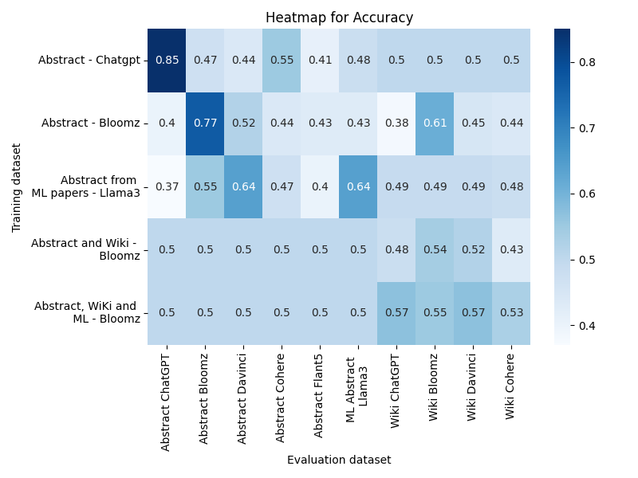
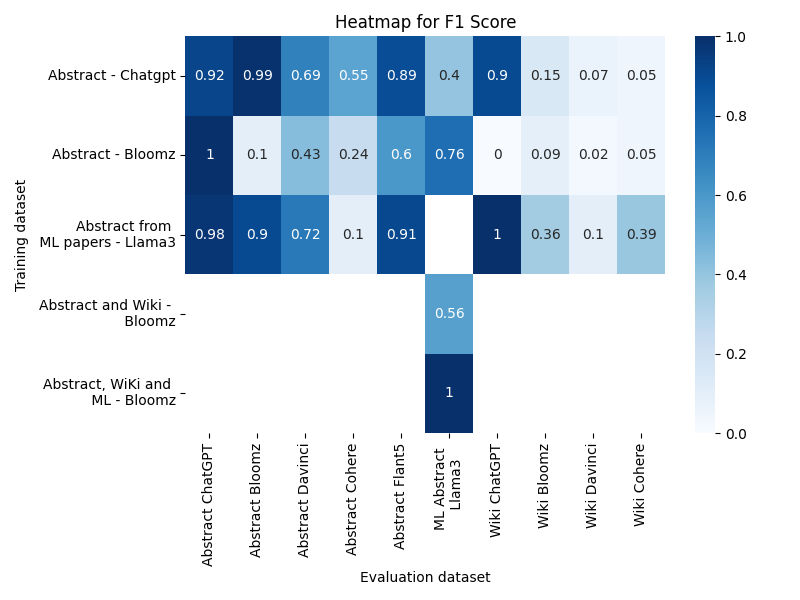

# 🤖🔍 Examining the Robustness and Resilience of AI-Generated Text Detectors
<p align="justify">
While various AI generated detectors claim high accuracy across different generative models and attack types, this repository presents a critical evaluation of popular text detectors—BLOOMZ, RoBERTa, and XGBoost.Our experiments assess their robustness against text generated by diverse LLMs with varying linguistic styles, focusing on cross-model and cross-domain evaluations, and their resilience to adversarial and prompt-based attacks. EExperiment to estimate of the amount of additional data, representing new patterns or styles, required to significantly improve the performance of fine-tuned detectors, particularly in cross-model and cross-domain scenarios 
</p>

### Final project report is available at [report](results/final-report/Examining_the_Robustness_and_Resilience_of_AI_Generated_Text_Detectors.pdf)
### Final presentation slides is available at [presentation slides](results/slides/Project%20_%20Examining%20the%20Robustness%20and%20Resilience%20of%20AI-Generated%20Text%20Detectors.pdf)
### Results of each experiment is available at [experiment-results](results/result-report)


##
### Otto-von-Guericke-Universität Magdeburg, Germany
|Team members|
| -------- |
|Supriya Pandurangacharya Upadhyaya|
|Aarathi Vijayachandran|
|Shashankh M G|

|Supervisors|
| -------- |
|M.Sc Marcus Thiel|
|Prof. Dr.-Ing. Andreas Nürnberger|
##
### Execution instruction to run the experiments
Following notebook is a reference on how to run the experiments [run experiments](notebooks/run_experiment.ipynb). 

```
!nohup python3 -u main.py --modelType xgboost --task finetuneAndEval --trainData chatgpt --dataType abstract --preprocessing True --log_folder_name xgboost_finetuneval_chatgpt --title 'XGBoost Finetune and Evaluation - chatgpt' &> ./results/logs/xgboost_finetuneeval_chatgpt.log&
```
```
options:
  -h, --help            show this help message and exit
  --modelType {roberta,bloomz,xgboost}
                        Type of the model: roberta, bloomz, or xgboost
  --train TRAIN         Train the model: true or false
  --trainData {chatgpt,bloomz,cohere,flat5,davinci,llama3,gemini,chatgptBloomz,bloomzWiki,bloomzWikiML}
                        Training data source: chatgpt, bloomz, cohere, flat5, davinci or llama3
  --dataType {abstract,wiki,ml}
                        Type of data: abstract, wiki, or ml
  --task {evalPretrained,finetuneAndEval,attack,trainOnSubset}
                        Type of data: abstract, wiki, or ml
  --preprocessing       Use the preprocessed dataset : true or false
  --log_folder_name LOG_FOLDER_NAME
                        Log folder name
  --title TITLE         Title
  --percentage PERCENTAGE
                        percentage
```


##
### Results 

##### Accuracy heatmap for XGBoost based detector


##### F1 Score heatmap for BLOOMZ based detector



